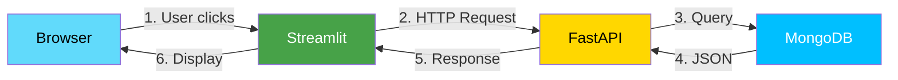

# Streamlit-MongoDB-Manager
## 🗄️ MongoDB Manager - Full Stack Portfolio Project

A complete full-stack application for managing MongoDB databases, built with **FastAPI**, **Streamlit**, and **MongoDB Atlas**.

---

## 🚀 Features

### Backend API (FastAPI)
- Full CRUD operations for users and posts
- RESTful endpoints with Swagger documentation
- MongoDB Atlas connection
- CORS enabled for frontend communication

### Frontend UI (Streamlit)
- **Dashboard**: View metrics (total users, posts, avg age)
- **User Management**: Create, read, update, delete users
- **Post Management**: Create posts, view by user, delete posts
- **Personal Dashboard**: Interactive demo with save-to-database feature

### Technologies Used
| Layer | Technology |
|-------|------------|
| Backend | FastAPI, Uvicorn |
| Frontend | Streamlit |
| Database | MongoDB Atlas (Cloud) |
| Data Validation | Pydantic |
| HTTP Client | Requests |

## 📋 API Endpoints

| Method | Endpoint | Description |
|--------|----------|-------------|
| GET | `/` | API status |
| GET | `/users` | Get all users |
| POST | `/users` | Create user |
| GET | `/users/{id}` | Get user by ID |
| PUT | `/users/{id}` | Update user |
| DELETE | `/users/{id}` | Delete user |
| GET | `/posts` | Get all posts |
| POST | `/posts` | Create post |
| GET | `/users/{id}/posts` | Get user's posts |
| DELETE | `/posts/{id}` | Delete post |

## 🛠️ Installation

### Prerequisites
- Python 3.8+
- MongoDB Atlas account (free tier)
- Git

## AND Install this requirement.txt:
```
pip install -r requirements.txt
```

---

## 🚀 Running the Application

Terminal 1: Start Backend (Server runs on http://localhost:8002)
```
python exe19_backend.py
```

Terminal 2: Start Frontend (App opens at http://localhost:8501)
```
streamlit run exe19_mongo_ui.py
```

Optional: Personal Dashboard
```
streamlit run exe19_dashboard.py --server.port 8502
```

---

# 🏗️ Framework Structure

---

# UI Overview


